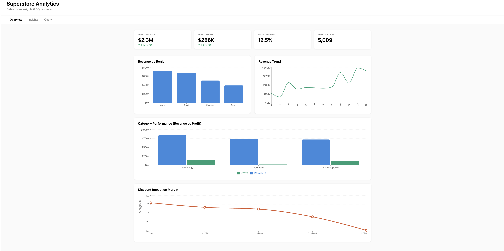

# 📊 Superstore Sales Analytics Dashboard

React Flask SQLite

An end-to-end business intelligence application that analyzes retail sales data to uncover trends in revenue, profitability, customer behavior, and product performance.

This project demonstrates the full analytics workflow, including data extraction, SQL analysis, KPI development, backend API construction, and interactive dashboard design.

---

## 🚀 Project Overview

Organizations rely on analytics to answer questions such as:

* Which regions generate the highest revenue?
* Which product categories are most profitable?
* How do sales and profit trends change over time?
* Which customers contribute the most value?
* What products should be promoted or discontinued?

This dashboard provides executive-level insights using the well-known Superstore dataset and simulates the type of business intelligence solutions used by modern analytics teams.

---

## 🖼 Dashboard Preview

> Add screenshots or a GIF here to showcase your dashboard.

```markdown

```

---

## ✨ Key Features

* 📈 Interactive KPI dashboard with revenue, profit, and order metrics
* 🌎 Regional performance analysis
* 📦 Product category and subcategory insights
* 👥 Customer segmentation and top-customer analysis
* 📅 Time-series trend analysis
* 🔍 REST API delivering data to the frontend
* 📱 Responsive user interface

---

## 🛠 Tech Stack

### Data & Analytics

* Python
* Pandas
* Pandasql
* SQLite
* SQL

### Backend

* Flask
* SQLite

### Frontend

* React
* Recharts
* Tailwind CSS

### Development Tools

* GitHub
* Git
* Visual Studio Code

---

## 📊 Business Insights Generated

The dashboard enables stakeholders to:

* Identify top-performing regions and sales territories
* Monitor profit margins across product categories
* Analyze seasonality and long-term trends
* Detect high-value customers
* Evaluate product portfolio performance
* Support data-driven strategic decisions

---

## 🏗 Project Architecture

```text
CSV Data → Python ETL → SQLite Database → Flask API → React Dashboard → Interactive Visualizations
```

---

## 📂 Repository Structure

```text
superstore-analytics-dashboard/
│
├── backend/
│   ├── app.py
│   ├── analysis.py
│   ├── database.py
│   └── superstore.db
│
├── frontend/
│   ├── src/
│   └── package.json
│
├── requirements.txt
└── README.md
```

---

## ⚙️ Installation & Setup

### 1. Clone the Repository

```bash
git clone https://github.com/yourusername/superstore-analytics-dashboard.git
cd superstore-analytics-dashboard
```

### 2. Create a Virtual Environment

```bash
python -m venv venv
```

Activate it:

**macOS/Linux**

```bash
source venv/bin/activate
```

**Windows**

```bash
venv\Scripts\activate
```

### 3. Install Python Dependencies

```bash
pip install -r requirements.txt
```

### 4. Start the Backend

```bash
cd backend
python app.py
```

### 5. Start the Frontend

```bash
cd frontend
npm install
npm start
```

### 6. Open the Application

Navigate to:

```text
http://localhost:3000
```

---

## 📈 Example KPIs

* Total Revenue
* Total Profit
* Profit Margin
* Average Order Value
* Top Region
* Best-Selling Products
* Customer Lifetime Value

---

## 🎯 Skills Demonstrated

* Data Cleaning and Transformation
* Exploratory Data Analysis (EDA)
* SQL Query Optimization
* KPI Design
* REST API Development
* Dashboard Development
* Business Intelligence
* Full-Stack Data Applications
* Data Storytelling

---

## 🚀 Future Enhancements

* Predictive sales forecasting using scikit-learn
* Customer segmentation with clustering
* Deployment to Amazon Web Services or Vercel
* User authentication
* Automated ETL pipelines

---

## 👤 Author

**Reese Farquharson**

* Aspiring Data Analyst / Data Scientist
* Interests: Analytics, Machine Learning, Business Intelligence, and Software Engineering

---

## 📄 License

This project is licensed under the MIT License.

---
